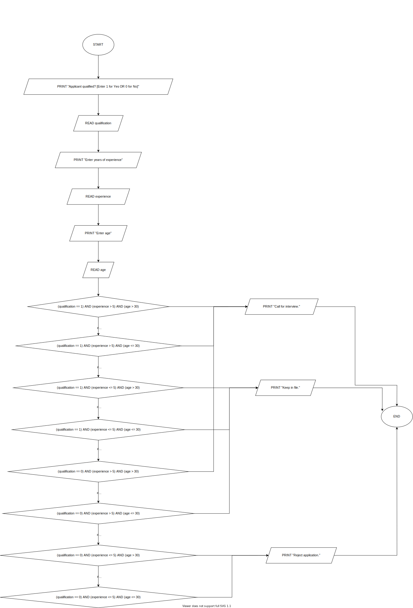

4. Design an algorithm using pseudocode and flowchart for the following scenario:

PCK Limited wishes to employ a systems analyst to undertake a major project. The decision will be based on the following:
If a person is suitably qualified, has experience of more than 5 years and is aged over 30, he will be called for an interview. If he is less than 30 years old but qualified and has the necessary experience, he will also be called for an interview. If the candidate is qualified and is aged over 30 but lack of experience, his record will be kept on file. If the person is qualified but is neither experienced nor over 30 years old, he will then be put on file.

If he does not have the necessary qualification but the candidate is experienced and is over 30 years old, he will be called for an interview. If he has the relevant experience but not the qualification and is under-aged, his record will be kept on file. If he does not have the necessary qualification or experience but is aged over 30 his application will be rejected. He will also be rejected if he does not meet all conditions.


```pseudocode
BEGIN
  PRINT "Applicant qualified? [Enter 1 for Yes OR 0 for No]"
  READ qualification
  PRINT "Enter years of experience"
  READ experience
  PRINT "Enter age"
  READ age
  IF ((qualification == 1) AND (experience > 5) AND (age > 30)) THEN
  PRINT "Call for interview."
  ENDIF
  IF ((qualification == 1) AND (experience > 5) AND (age <= 30)) THEN
  PRINT "Call for interview."
  ENDIF
  IF ((qualification == 1) AND (experience <= 5) AND (age > 30)) THEN
  PRINT "Keep in file."
  ENDIF
  IF ((qualification == 1) AND (experience <= 5) AND (age <= 30)) THEN
  PRINT "Keep in file."
  ENDIF
  IF ((qualification == 0) AND (experience > 5) AND (age > 30)) THEN
  PRINT "Call for interview."
  ENDIF
  IF ((qualification == 0) AND (experience > 5) AND (age <= 30)) THEN
  PRINT "Keep in file."
  ENDIF
  IF ((qualification == 0) AND (experience <= 5) AND (age > 30)) THEN
  PRINT "Reject application."
  ENDIF
  IF ((qualification == 0) AND (experience <= 5) AND (age <= 30)) THEN
  PRINT "Reject application."
  ENDIF
END
```


